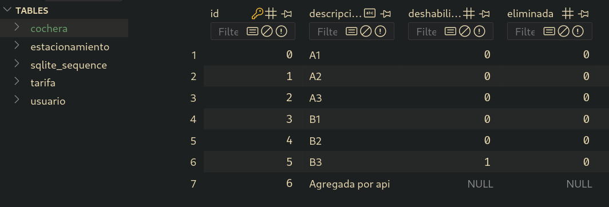
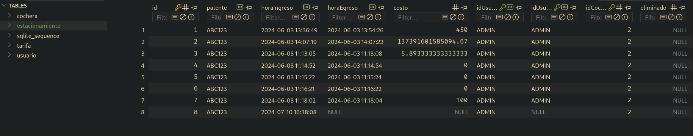
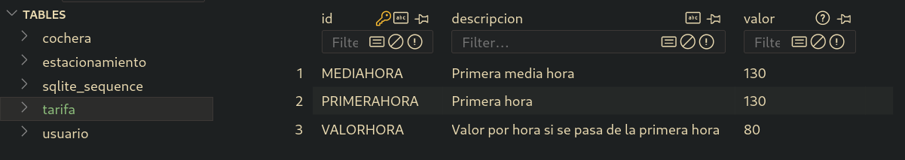

# CocherasEnClaseLnd

## Requerimientos de la app

Pueden encontrar el figma [en este link](https://www.figma.com/design/Qbx06MNXJMip5zoa2xK4B9/Cocheras) y la documentación de la API en [en este link](https://documenter.getpostman.com/view/15402940/2sAXjSxoFk).

La app consta de una página de login y tres páginas adicionales: Estado de las cocheras, reportes y precios.

### Login

La página de Login debe contener un formulario con dos campos: usuario y contraseña. De ser incorrectas, mostrar un mensaje de error. De ser correctas, redirigir a la página de estado de las cocheras. Ir a cualquier página sin haberse logueado previamente debe redirigir al login. Debe haber un botón de logout en el encabezado que invalide las credenciales activas y la página pase a comportarse como 'no logueado'.

### Estado de las cocheras

Esta página cuenta con una tabla de 4 columnas:
1. N°: será el número de fila
2. Disponibilidad: será la palabra 'Disponible', 'No disponible' o la patente del vehículo que la esté utilizando
3. Ingreso: el horario de ingreso del vehículo, si está ocupada, el horario de deshabilitación, si está deshabilitada, nada en otro caso.
4. Acciones: un botón para habilitar o deshabilitar la cochera (íconos diferentes) y un botón para eliminarla.

Al final de la tabla debe haber un botón para agregar una cochera. Al clikearlo aparece una nueva cochera.

Al clickear la palabra 'Disponible' debe aparecer un modal con un formulario para asignar un vehículo a la cochera, que pasará a estar ocupada. Al clikear la patente de una cochera ocupada, debe aparecer un modal con el monto a pagar y un botón para liberar la cochera, que pasará a estar disponible.

Al intentar borrar cualquier cochera, debe aparecer un modal de confirmación.

Si se deshabilita o elimina una cochera ocupada, el comportamiento no está definido.

### Reportes

Esta página cuenta con otra tabla de 4 columnas:
1. N°: será el número de fila
2. Mes: será el mes al que corresponde el reporte
3. Usos: la cantidad de veces que cualquier cochera fue ocupada en ese mes
4. Cobrado: el monto total cobrado por las cocheras ocupadas en ese mes

Debe haber una fila por cada mes que haya habido actividad en las cocheras. No es necesario que se muestren meses sin actividad. Sí es necesario que se muestren los meses en orden cronológico.

### Precios

Esta página cuenta con una tabla de 3 columnas:
1. Tiempo: la categoría de tiempo cobrable (Primer media hora, primer hora, precio por hora)
2. Costo: el monto a cobrar por esa categoría
3. Acciones: un único botón para editar el costo de esa categoría

Al presionar el botón de editar, aparece un modal con un formulario para cambiar el costo de esa categoría. Al presionar 'Guardar', el costo aparece actualizado en la tabla. El costo calculado de los vehículos que actualmente ocupan cocheras se ve actualizado, sin considerar que haya corrido parte del tiempo con otro precio.

## Consideraciones arquitecturales

Es recomendado contar con servicios para manejar cada módulo lógico de la aplicación:

- AuthService: para manejar el login y autenticación
- CocherasService: para manejar la API de cocheras
- EstacionamientosService: para manejar la API de estacionamientos
- PreciosService: para manejar la API de precios

El propósito de los servicios es realizar búsquedas y filtrados de datos, cálculos numéricos y determinación de condiciones. Las componentes deberían preocuparse por mostrar filas ya procesadas, irrespecto de cómo se obtuvieron.

También es recomendado contar con interfaces para los objetos que retornan de las APIs.

- Cochera: el objeto que representa una cochera, la API de cocheras retorna una lista de estas
- Estacionamiento: el objeto que representa un estacionamiento, la API de estacionamientos retorna una lista de estos
- Precio: el objeto que representa un precio, la API de precios retorna una lista de estos

Contar con tipado fuerte por medio de estas interfaces ayuda a evitar errores de programación y guía la implementación.

## Ejemplos de las tablas utilizadas

La descripción es un campo de texto libre, actualizable. Aquí podemos almacenar metadatos de la cochera cuando sea necesario.

La hora de ingreso y egreso se almacenan automáticamente. El idCochera refiere a la cochera que está siendo ocupada. La fila que tenga horaEgreso nula está actualmente ocupada. El costo se almacena automáticamente al cerrarse el estacionamiento con las tarifas actuales. Contamos adicionalmente con el usuario que hizo el ingreso y el usuario que hizo el egreso. Estos deben ser suministrados.

Observar que la categoría de tiempo es el id, y es a través de este id que se indica a la API qué tarifa se está modificando.

### Índice completo de la API

#### Cocheras:

- GET /cocheras: devuelve todas las cocheras
- GET /cocheras/:id: devuelve una cochera por id
- POST /cocheras: crea una cochera
- DELETE /cocheras/:id: elimina una cochera
- PUT /cocheras/:id: actualiza una cochera
- POST /cocheras/:id/disable: deshabilita una cochera
- POST /cocheras/:id/enable: habilita una cochera

#### Estacionamientos:

- GET /estacionamientos: devuelve todas las instancias de estacionamientos, de cualquier cochera, abiertas y cerradas
- GET /estacionamientos/:id: devuelve un estacionamiento por su id propio
- POST /estacionamientos/abrir: abre un estacionamiento en una cochera a un vehículo
- PATCH /estacionamientos/cerrar: cierra el estacionamiento de un vehículo

#### Precios:

- GET /tarifas: devuelve todas las tarifas
- PUT /tarifas/:id: actualiza una tarifa
